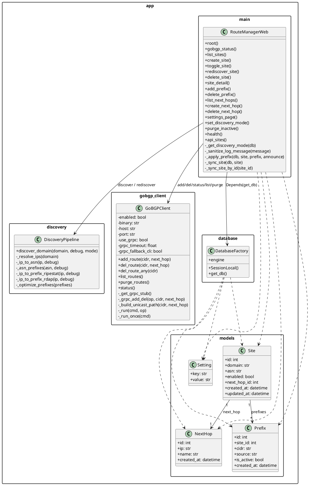

# Architecture

## Scope

`goBGP Route Manager` is a server-rendered FastAPI application that stores desired routing state in SQLite and applies that state to a goBGP daemon over gRPC, with CLI fallback.

The project has four main layers:

- Presentation: FastAPI endpoints and Jinja templates in `app/main.py` and `app/templates/*`
- Application orchestration: request handlers, validation, background sync, settings handling
- Integration: `GoBGPClient` and the discovery pipeline in `app/gobgp_client.py` and `app/discovery.py`
- Persistence: SQLAlchemy engine/session factory and ORM models in `app/database.py` and `app/models.py`

## UML Class Diagram

## Component Roles

### `app/main.py`

This is the application orchestrator.

- Owns the FastAPI app instance, route handlers, template rendering and request validation
- Decides when to call discovery, when to write to the database and when to schedule background sync
- Contains operational helper functions such as `_apply_prefix`, `_sync_site` and `_sync_site_by_id`

### `app/gobgp_client.py`

This is the integration boundary to goBGP.

- Prefers gRPC for route operations and status checks
- Falls back to the `gobgp` CLI when configured or when gRPC fails
- Normalizes route add/delete/list/purge/status into one object API
- Hides transport details from the rest of the application

### `app/discovery.py`

This is the domain-to-routes pipeline.

- Resolves a domain to IPv4 addresses
- Maps IPs to ASNs using a provider fallback chain
- Maps ASNs or IPs to prefixes depending on selected discovery mode
- Collapses and normalizes prefixes before returning them to the caller

### `app/database.py`

This is the persistence bootstrap.

- Creates the SQLAlchemy engine
- Exposes `SessionLocal`
- Enables SQLite foreign keys on connect
- Supplies `get_db()` for FastAPI dependency injection

### `app/models.py`

This is the domain model.

- `Site` is the aggregate root for routable domain/group state
- `NextHop` is a reusable lookup entity
- `Prefix` is a child entity of `Site`
- `Setting` stores low-volume runtime configuration such as discovery mode

## Patterns Used

### 1. Gateway / Adapter

Used in `app/gobgp_client.py`.

`GoBGPClient` hides protocol details behind a stable method set:

- `add_route()`
- `del_route()`
- `list_routes()`
- `status()`

The rest of the application does not need to know whether the actual transport is:

- gRPC
- normal `gobgp` CLI
- legacy CLI syntax fallback

This is the most important integration abstraction in the codebase.

### 2. Strategy + Fallback Chain

Used in `app/discovery.py`.

There are two strategy dimensions.

Discovery mode strategy:

- `network_info`
- `rdap`
- `asn_prefixes`

Provider fallback strategy:

- `IPinfo` for `IP -> ASN`
- `IPinfo` for `ASN -> prefixes`
- `RIPEstat` fallback for prefixes
- `BGPView` optional fallback when enabled

The caller only passes `mode`; provider selection and fallback logic stay encapsulated in the pipeline.

### 3. Dependency Injection

Used in `app/main.py`.

FastAPI injects infrastructure dependencies into handlers:

- `db: Session = Depends(get_db)`
- `background_tasks: BackgroundTasks`

This keeps route handlers stateless and avoids global mutable session objects.

### 4. Data Mapper

Used via SQLAlchemy ORM in `app/models.py` and `app/database.py`.

The database schema is represented by mapped classes, while persistence operations happen through the session:

- `db.add(...)`
- `db.commit()`
- `db.refresh(...)`
- `db.query(...)`

The entities themselves do not contain SQL.

### 5. Background Job Dispatch

Used in `app/main.py`.

Longer route synchronization work is not executed inline with the HTTP request. Instead the application schedules:

- `background_tasks.add_task(_sync_site_by_id, site.id)`

This is not a durable queue, but it is still a clear asynchronous boundary that improves UI responsiveness.

### 6. Server-Side Template View

Used in `app/templates/*`.

The application renders HTML on the server with Jinja templates rather than using a SPA frontend. This keeps the UI simple and closely coupled to the backend workflow.

## Data Flow

### 1. Create Site With Auto Discovery

1. Browser submits `POST /sites`
2. `create_site()` validates the selected `next_hop_id`
3. A `Site` row is inserted first so the object exists even if discovery later returns no prefixes
4. If `discover=on`, `discover_domain()` resolves the domain, selects a discovery mode, finds prefixes and returns a normalized prefix list
5. The handler stores `site.asn`
6. Returned prefixes are inserted into `Prefix` rows with `source="discovery"`
7. If the site is enabled, `_sync_site_by_id()` is scheduled in a background task
8. The background job reads the current site state from SQLite and applies each active prefix to goBGP via `GoBGPClient`

### 2. Create Site Without Discovery

1. Browser submits `POST /sites` with discovery disabled
2. The handler inserts the `Site`
3. No prefixes are created automatically
4. If enabled, sync still runs, but there is nothing to announce until prefixes are added manually

### 3. Manual Prefix Add

1. Browser submits `POST /sites/{site_id}/prefixes`
2. `add_prefix()` validates CIDR syntax with `ip_network(..., strict=False)`
3. A `Prefix` row is inserted with `source="manual"`
4. If the parent site is enabled, `_apply_prefix()` calls `GoBGPClient.add_route()`

### 4. Site Toggle

1. Browser submits `POST /sites/{site_id}/toggle`
2. `toggle_site()` flips `site.enabled`
3. Background sync is scheduled
4. `_sync_site()` iterates active prefixes
5. Each prefix is announced or withdrawn depending on the new `enabled` value

### 5. Rediscover Site

1. Browser submits `POST /sites/{site_id}/rediscover`
2. The handler runs `discover_domain()` again using the configured discovery mode
3. Existing discovery-origin prefixes are compared with the newly discovered prefix set
4. Removed prefixes are withdrawn and deleted
5. New prefixes are inserted and announced if the site is enabled
6. Manual prefixes are preserved because only discovery-owned prefixes are reconciled

### 6. Status Page

1. Browser requests `GET /gobgp-status`
2. `GoBGPClient.status()` checks:
   - local `gobgp` binary availability
   - goBGP daemon reachability
   - effective ability to apply routes
3. The result is rendered as a server-side HTML status page

## Current Architectural Tradeoffs

- Background tasks are in-process only. If the process dies, queued sync work is lost.
- Schema creation happens on startup via `Base.metadata.create_all(...)`; there is no migration layer yet.
- Persistence logic is still embedded in route handlers instead of being extracted into a dedicated service layer.
- Discovery and route apply are synchronous inside worker functions; there is no rate limiting or durable retry queue.
- There is no authentication/authorization layer yet, so deployment should assume trusted networks only.

## Extension Points

- Replace FastAPI `BackgroundTasks` with a real job queue for durable sync
- Extract service classes out of `app/main.py` if business logic grows further
- Add Alembic migrations
- Add audit trail / route operation history table
- Add auth before any public or semi-public deployment
